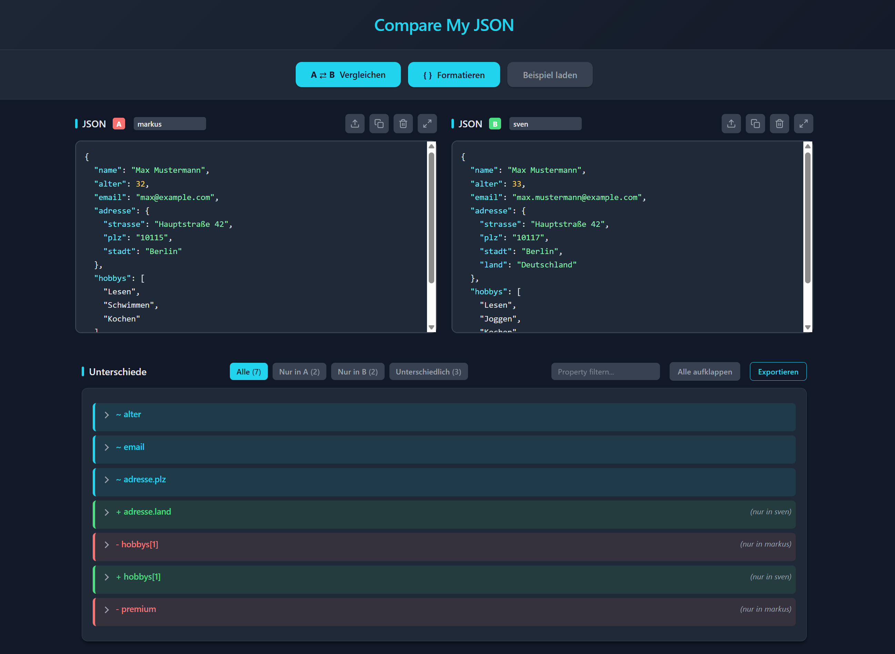

# Compare My JSON

Eine clientseitige Webanwendung zum Vergleichen von JSON-Daten. Keine Server-Komponente erforderlich - läuft vollständig im Browser.

## Features

### JSON-Eingabe
- **Zwei Editoren** für JSON A und JSON B mit Syntax-Highlighting
- **Datei-Upload** per Button oder Drag & Drop
- **Kopieren** des Inhalts in die Zwischenablage
- **Leeren** einzelner Textareas
- **Vollbild-Modus** für komplexere JSON-Strukturen
- **Aliase** für die JSON-Quellen (z.B. "Production", "Staging")
- **Beispieldaten** zum schnellen Testen

### Vergleich
- **Struktureller Vergleich** von JSON-Objekten
- **Array-Vergleich** nach Vorhandensein (nicht nach Position)
- **Rekursiver Vergleich** verschachtelter Objekte
- **Drei Unterschiedstypen**:
  - Nur in A (rot)
  - Nur in B (grün)
  - Unterschiedliche Werte (cyan)

### Ergebnis-Anzeige
- **Auf-/zuklappbare** Unterschiede
- **Filter** nach Unterschiedstyp (Alle, Nur in A, Nur in B, Unterschiedlich)
- **Property-Filter** zum Suchen nach bestimmten Feldnamen
- **Counter** zeigen Anzahl pro Kategorie
- **Alle auf-/zuklappen** Button

### Export
- **Textdatei-Export** der Unterschiede
- Enthält Datum, Aliase und alle Unterschiede gruppiert nach Typ

## Verwendung

1. `compare.html` im Browser öffnen
2. JSON-Daten in die Textfelder eingeben oder Dateien laden
3. Optional: Aliase für die Quellen eingeben
4. "A ⇄ B Vergleichen" klicken
5. Unterschiede analysieren, filtern und ggf. exportieren

## Technologie

- Reines HTML, CSS und JavaScript
- Kein Node.js oder Build-Prozess erforderlich
- Dark Mode mit Cyan-Akzentfarbe (Tailwind-inspiriert)
- Responsive Design

## Dateien

- `compare.html` - HTML-Struktur
- `styles.css` - Styling (Dark Mode)
- `script.js` - Vergleichslogik und Interaktionen
